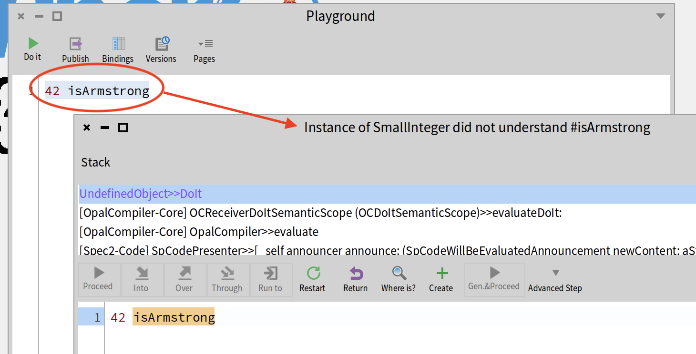
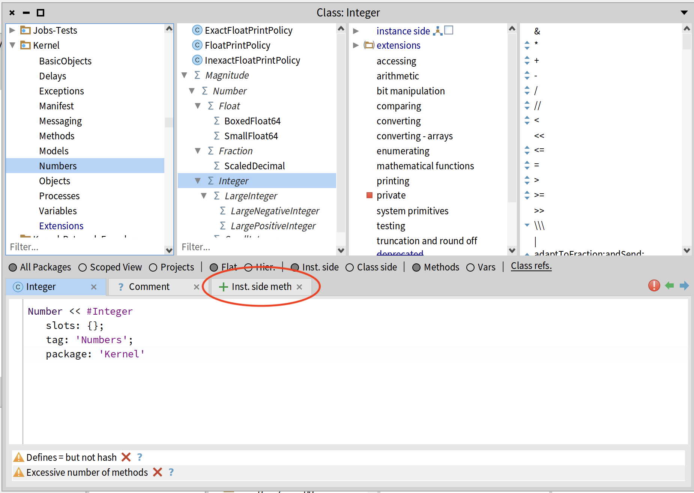
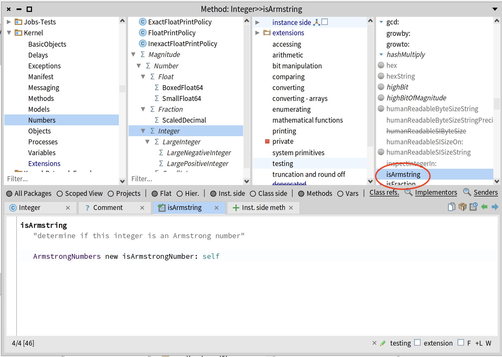
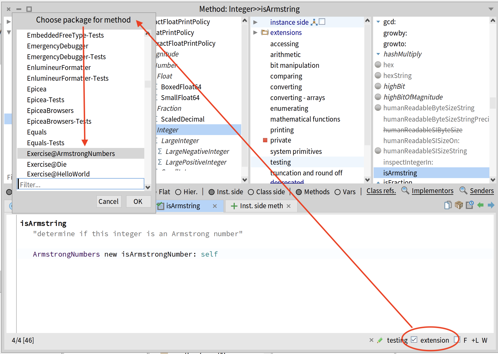
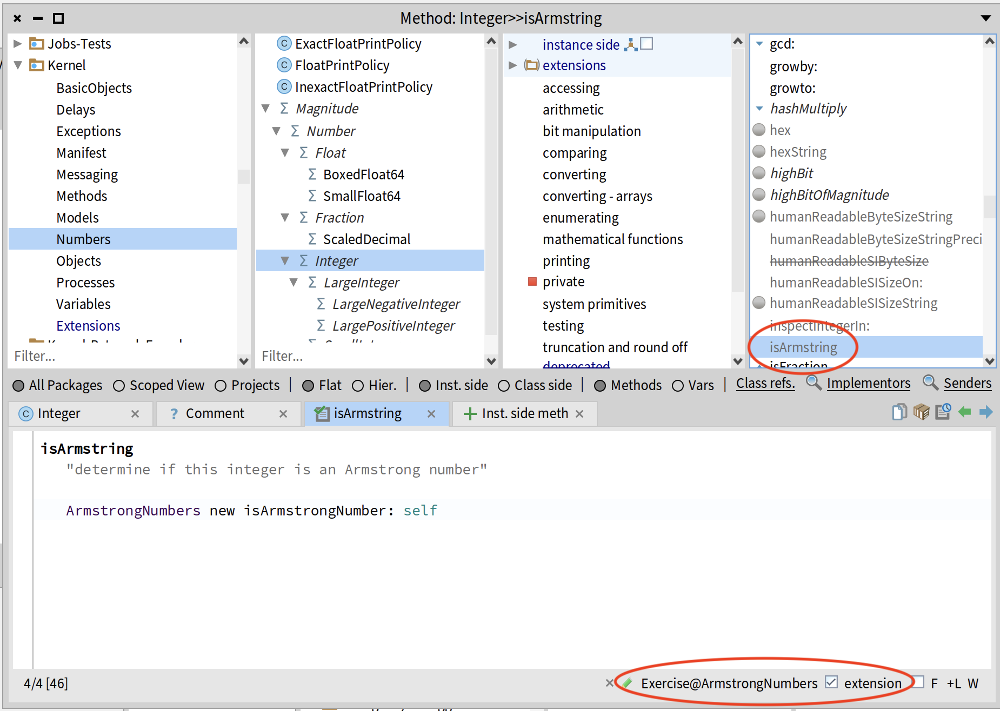
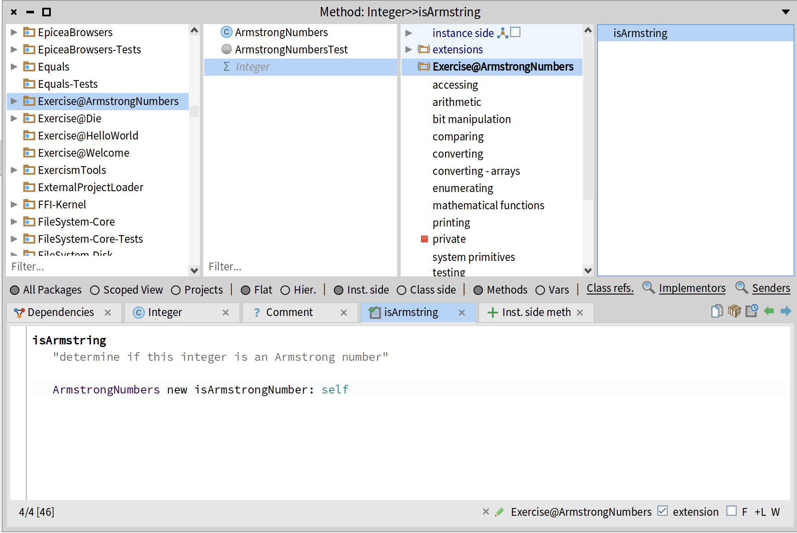
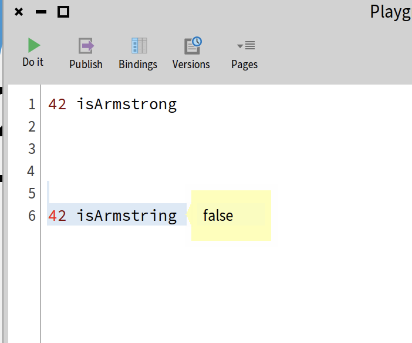
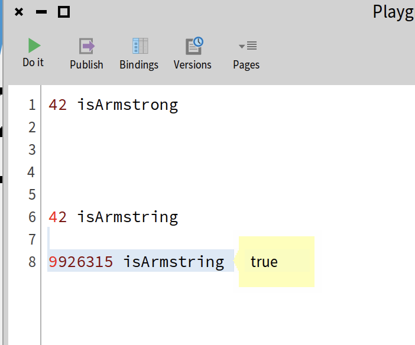

# Pharo

[Pharo][pharo] is a Smalltalk dialect.
In my university days, Smalltalk was the OO teaching language, so it has a fond place in my heart.

I won't dig into it. See the Pharo website to learn more.

## Extension methods

Because Pharo is typically coded within the Pharo UI, the entire language is available to you for browsing but also modifying!
You can easily add new methods to any class.
But that can quickly lead to a real mess.

Pharo has projects to act as namespaces for your code.
When you add new methods to existing classes, they can be configured as _extension_ methods, stored in the context of your project.

Let's walk through an example, starting with the [Armstrong Numbers][armstrong] exercise.
That exercise gets you to write an `ArmstrongNumbers` class, and an `isArmstrongNumber: anInteger` instance method.
Suppose we want to be able to provide `isArmstrong` as an instance method on the Integer class.

1. first, let's just try it in the Playground

    

1. in the Browser, navigate to Kernel -> Numbers -> Integer; select the "+ Inst. side meth" tab.

    

1. type in the method implementation and save (cmd-S on the mac); we've created an Integer instance method.

    

1. select the "extension" checkbox in the bottom-right corner; select the Exercise@ArmstrongNumbers package to store it in; click OK.

    

1. now the method name is grey in the instance method list, and the package name shows up at the bottom of the browser.

    

1. and if we navigate back to the Exercise@ArmstrongNumbers package, we can see "Integer" show up in the class list (grey) where we can find our extension method. And it's only now that I realize I've mistyped it (not gonna redo the screenshots).

    

So now, back to the playground and try it again:

1. a number that is not an Armstrong number

    

1. a number that _is_ an Armstrong number

    

[pharo]: https://pharo.org/
[armstrong]: https://exercism.org/tracks/pharo-smalltalk/exercises/armstrong-numbers
