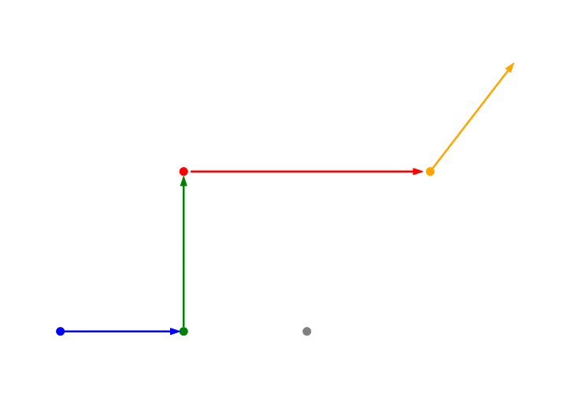
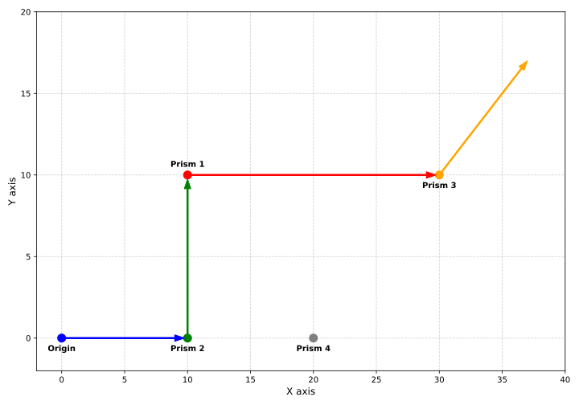

# Add an image to Prism exercise instructions

* [`prism` specification](https://github.com/exercism/problem-specifications/tree/main/exercises/prism)
* Forum discussion [starting comment](http://forum.exercism.org/t/new-exercise-proposal-prism/26302/30)

## Dark theme

[laser_path-dark.svg](./laser_path-dark.svg)

## Light theme

[laser_path-light.svg](./laser_path-light.svg)

## Python source

[source code](./laser_path.py.md)
